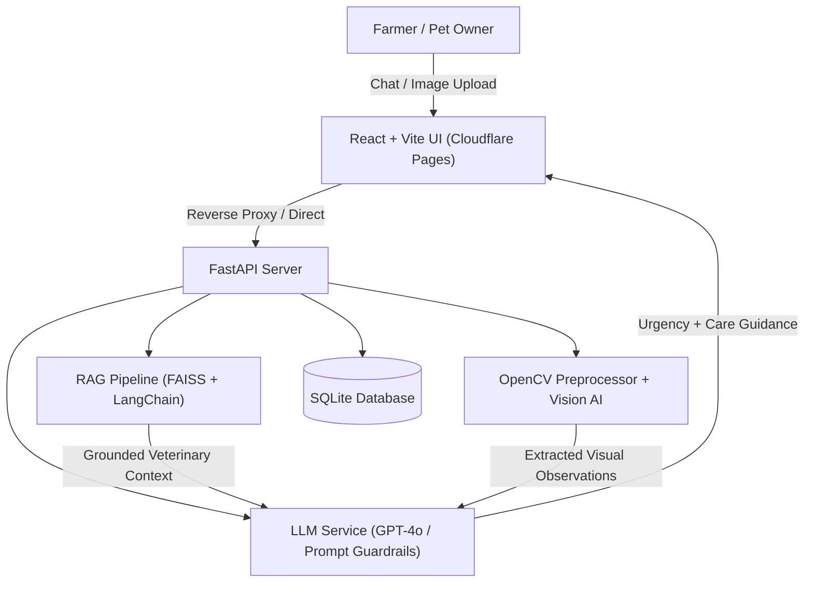

# PashuCare – AI Animal Healthcare Assistant 🐾🩺

[](https://fastapi.tiangolo.com)
[](https://react.dev)
[](https://openai.com)
[](https://github.com/facebookresearch/faiss)
[](LICENSE)

**PashuCare** is an intelligent, multilingual AI animal healthcare assistant designed to empower pet parents, dairy farmers, and rural animal caretakers with timely clinical symptom observation, preliminary care guidance, and veterinary next steps.

---

## 🌟 Key Features

- **🗣️ Multilingual & Hinglish Understanding:**  
  Allows rural farmers and pet caretakers to report symptoms naturally in **Hindi**, **Hinglish**, or **English** (e.g., *"गाय चारा नहीं खा रही"*, *"Sheru ko ulti aur susti hai"*).

- **📚 Retrieval-Augmented Generation (RAG):**  
  Uses **FAISS vector search** and OpenAI `text-embedding-3-small` with LangChain text splitters to ground AI guidance in curated veterinary clinical literature, minimizing hallucinations.

- **📷 Computer Vision Observation:**  
  Leverages **OpenCV** preprocessing and multimodal Vision AI to examine photos of skin conditions, posture abnormalities, wounds, or discharge.

- **🚨 Clinical Urgency Classification:**  
  Instant categorization into **LOW**, **MODERATE**, or **HIGH** urgency, highlighting red flags and prioritizing immediate physical veterinary intervention when needed.

- **📋 Structured Case Summaries:**  
  Generates printable/exportable clinical case reports detailing reported observations, home care measures, and questions for consulting veterinarians.

- **🐄 Animal Health Records:**  
  Maintains profiles for cattle, pets, and livestock (age, weight, breed, vaccination history, past consultations).

---

## 🏗️ Architecture



---

## 📁 Project Structure

```text
pashucare/
├── backend/
│   ├── app/
│   │   ├── main.py              # FastAPI entry point & CORS configuration
│   │   ├── config.py            # Environment configuration
│   │   ├── database.py          # SQLAlchemy SQLite connection
│   │   ├── models.py            # Animal & Consultation ORM models
│   │   ├── schemas.py           # Pydantic validation schemas
│   │   ├── routes/              # Modular API endpoints (chat, vision, animals, etc.)
│   │   └── services/            # LLM, RAG (FAISS), OpenCV Vision, & Triage logic
│   ├── data/knowledge/          # Curated veterinary knowledge base
│   ├── Dockerfile               # Production container definition
│   └── requirements.txt         # Python dependencies
├── frontend/
│   ├── functions/api/           # Cloudflare Pages edge proxy functions
│   ├── src/
│   │   ├── components/          # Reusable UI components (Navbar, Chat, Uploaders)
│   │   ├── pages/               # Landing, Consultation, Dashboard, History, Animals
│   │   └── services/            # Axios API client
│   ├── index.html               # Entry HTML with modern typography
│   └── vite.config.js           # Vite dev and build settings
├── CLOUDFLARE_DEPLOYMENT_GUIDE.md # Cloudflare deployment handbook
└── README.md
```

---

## 🚀 Quickstart Guide

### Prerequisites
- **Python 3.10+**
- **Node.js 18+** & **npm**
- **OpenAI API Key**

---

### 1. Backend Setup

```bash
# Navigate to backend
cd backend

# Create and activate virtual environment
python -m venv venv
# On Windows:
.\venv\Scripts\activate
# On Linux/macOS:
source venv/bin/activate

# Install dependencies
pip install -r requirements.txt

# Configure environment
cp .env.example .env
# Open .env and add your OPENAI_API_KEY

# Run backend server
uvicorn app.main:app --reload --port 8000
```
Backend will run at: `http://localhost:8000` (API docs: `http://localhost:8000/docs`)

---

### 2. Frontend Setup

```bash
# Navigate to frontend (in a separate terminal)
cd frontend

# Install packages
npm install

# Run Vite dev server
npm run dev
```
Frontend will be available at: `http://localhost:5173`

---

## 🌐 Deployment

For step-by-step instructions on deploying the frontend to **Cloudflare Pages** and the backend to **Render/Cloudflare Tunnel**, please refer to [CLOUDFLARE_DEPLOYMENT_GUIDE.md](CLOUDFLARE_DEPLOYMENT_GUIDE.md).

---

## ⚠️ Veterinary Disclaimer

> **Important Notice:** PashuCare is an educational and preliminary decision-support assistant designed to aid caretakers in identifying symptoms and understanding urgency. **It is NOT a licensed veterinary clinic and does not prescribe medications.** For acute illness, severe bleeding, or emergencies, immediate physical consultation with a certified veterinarian is mandatory.

---

## 📄 License

This project is licensed under the MIT License.
